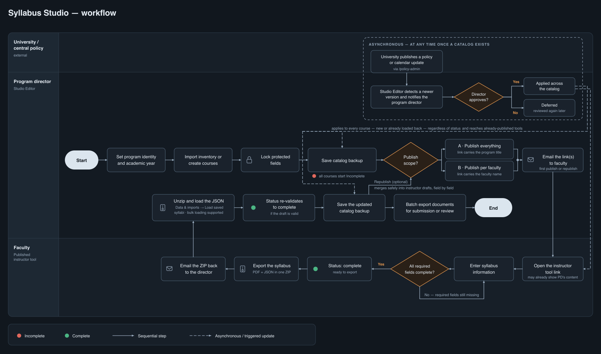

# Syllabus Studio

Syllabus Studio is a browser-based tool for keeping every syllabus in an academic program consistent and professionally formatted. A **program director** builds one course catalog, decides which parts of a syllabus instructors may change, and publishes a private link to each instructor; the **instructor** fills in only their own term, schedule and content, then exports a finished syllabus as PDF, Word or LMS-ready HTML — with nothing to install and no accounts to create.

This repository contains the **ready-to-deploy build**, not the source code. Upload it to any Apache + PHP host and it runs.

---

## Try it first

**[syllabus-studio-demo.polyzaar.com](https://syllabus-studio-demo.polyzaar.com/)**

The demo is fully functional for exploring the editor, building a catalog and exporting syllabi. **Publishing instructor tools is disabled** on the demo, because publishing requires the server password and that is not shared. To publish, deploy your own copy — see [Deployment](#deployment).

---

## How it works

<a href="docs/program-director-workflow-dark.svg">
  
</a>

<p align="center"><em><a href="docs/program-director-workflow-dark.svg">Open the diagram full size →</a></em></p>

---

## The two roles

Everything in Syllabus Studio follows from a single split: the program owns the boilerplate, the instructor owns the term.

### Program director — the Editor (`/editor`)

Sets up **program identity** (university, college, department, program title, logo, brand colours), builds the **course catalog**, and marks every syllabus field **locked** or **editable**. Then publishes one **instructor tool** per instructor or per program, protected by a personal password. The director never fills in term-specific content.

### Instructor — a published tool (`/<program-slug>`)

Opens the link the director sent. Sees only their assigned courses and only the fields they are allowed to change: term and section, meeting pattern (or online asynchronous), contact details, objectives and outcomes, materials, assignments, the grading matrix and a week-by-week calendar generated from the program's academic calendar rules. Exports the finished syllabus as **PDF**, **Word (.docx)** or **HTML** straight from the browser.

Locked fields are pre-filled from the catalog and cannot be edited; editable fields are pre-seeded and can be overwritten. When the director republishes after updating the catalog, locked fields are refreshed and the instructor's own work is preserved.

### Policy administrator — `/policy-admin`

Optional third screen, behind its own separate password. The office that governs policy centrally publishes the **grade scale**, the **academic policies** text and the **academic calendar rules** to every program on the server at once. Holding the publish password grants nothing here, and vice versa.

---

## Deployment

### What you need

- Apache with `mod_rewrite` and `mod_headers`
- PHP 8 (SiteGround, cPanel and most shared hosts qualify)
- A domain or subdomain — `syllabus.your-university.edu`

> **This build deploys to a domain or subdomain root only.** Asset paths are absolute (`/assets/…`), so serving it from a subdirectory such as `/syllabus/` requires rebuilding from source with a base path set. Nothing else hardcodes a hostname — every URL the app generates comes from `window.location.origin` at runtime, so any domain works with no changes.

### 1. Upload

Into the **site root**:

| From this repo | Goes to |
|---|---|
| everything **inside** `dist/` — `index.html`, `assets/`, `defaults/`, `logos/` | site root |
| `server/.htaccess` | site root |
| `server/publish.php` | site root |

Then create an empty, **writable** `configs/` folder in the same root (`755` or `775`). Published instructor tools are written there.

`.htaccess` is not optional — it carries both the URL rewriting and the cache rules.

**Permissions:** directories `755`, files `644`. Do not apply `755` recursively; the execute bit means nothing on a JSON file. What actually decides whether publishing works is ownership: where PHP runs as your own account, `644` files you own are already writable. If PHP runs as `www-data` or similar, use `664` on files and `775` on `defaults/`.

### 2. Set the two passwords

Open `publish.php` and replace both placeholders, or better, set them as environment variables in your host's control panel and leave the fallbacks unused:

| Token | Who holds it | Grants |
|---|---|---|
| `PUBLISH_TOKEN` | every program director | publishing and unpublishing instructor tools |
| `POLICY_TOKEN` | the office governing policy centrally | `/policy-admin` — grade scale, academic policies, calendar rules |

They must be different, and both should be long and random. Holding one grants nothing about the other.

For `/policy-admin` to save, `defaults/` must also be writable; it creates a `defaults/history/` folder for the revision archive. If `defaults/` stays read-only the screen still loads and shows what is live, but publishing fails with a clear message.

### 3. Replace the shipped defaults with your own

The files in `defaults/` ship deliberately generic — a placeholder logo, `My University`, a blank department and program, and a standard A+–F grade scale.

| File | Holds |
|---|---|
| `defaults/editor-defaults.json` | university, college, department, program title, course prefix, logo reference, brand colours, academic year, grade scale, academic policies, technical support text, field defaults, grading columns |
| `defaults/calendar-rules.json` | term start rules, instruction and exam week counts, reading days, breaks, holidays |
| `defaults/inventory-settings.json` | cell mapping for importing courses from a spreadsheet (only if you use the XLS import) |
| `logos/` | your own logo file, referenced by `identity.logoDataUrl` in `editor-defaults.json` |

> **Edit a copy of the shipped file rather than writing a minimal one.** Values are merged over the compiled-in defaults, so any key you leave out silently falls back to a blank or generic value.

Leave `centralRevisions` in `editor-defaults.json` and `revision` in `calendar-rules.json` in place — they drive the central policy-update mechanism.

### 4. Check caching — do not skip this

Many shared hosts apply a blanket long `Cache-Control` to static files. That is correct for `assets/`, whose filenames change on every build, but wrong for `index.html` and `defaults/*.json`, whose URLs never change. Left cached, a returning browser keeps loading the previous release and **a deploy appears to do nothing**.

The supplied `.htaccess` sets `no-cache, must-revalidate` on `index.html` and every `.json`. Verify it actually took effect:

```bash
curl -sSI https://your-domain/index.html | grep -i cache-control
```

You want `no-cache, must-revalidate`. If you still see a long `max-age`, the host is serving static files from NGINX in front of Apache, which answers before `.htaccess` is consulted — fix it in the host's caching settings and purge. Working rewrites are *not* evidence that the headers are being applied.

### 5. Verify

In a **new incognito session** (close all incognito windows first — they share one cache):

1. `https://your-domain/` shows the "contact your program director" notice.
2. `https://your-domain/editor` opens the editor.
3. `https://your-domain/defaults/editor-defaults.json` returns **your** JSON, with `Cache-Control: no-cache`.
4. Program Identity in the editor shows your institution's values.
5. Publish a test program, open the instructor link, confirm the course list loads.

### URLs once deployed

| URL | What loads |
|---|---|
| `/` | a public notice pointing visitors at their program director |
| `/editor` | the program director's editor |
| `/policy-admin` | central policy and calendar administration |
| `/<program-slug>` | an instructor tool |
| `/?tool=<program-slug>` | the same, for hosts without URL rewriting |

The bare root deliberately does not open the editor. That is obscurity, not access control — if you need `/editor` genuinely restricted, add HTTP auth for it in `.htaccess`.

---

## Syllabus JSON schema

Every syllabus can be saved as a single JSON file and loaded back in. The file is **self-contained**: locked sections and catalog-owned course details are resolved into it at export time, so it is a complete record of what the PDF shows.

The full JSON Schema is **[`docs/syllabus.schema.json`](docs/syllabus.schema.json)**. In outline:

```jsonc
{
  "courseId": "c-4f2a",
  "term": "Fall",              // Fall | Winter | Spring | Summer  (Winter is quarter-system only)
  "year": "2027",
  "section": "001",

  "onlineAsync": false,        // true alone = fully online; true with meetings = hybrid
  "meetings": [
    { "day": "Tuesday", "startTime": "14:00", "endTime": "16:50", "location": "URBN 250" }
  ],

  "instructorName": "...",
  "instructorEmail": "...",
  "contactInformation": "<p>Office hours …</p>",
  "teachingAssistants": [
    { "id": "ta-1", "name": "...", "email": "...", "contact": "..." }
  ],

  // Rich-text sections (HTML). Each is already resolved: the instructor's text where the
  // field is editable, the catalog's text where it is locked.
  "coursePurpose": "<p>…</p>",
  "expectedLearning": { "objectives": "<p>…</p>", "outcomes": "<ul>…</ul>" },
  "materials":        { "readings": "<p>…</p>",   "technologies": "<p>…</p>" },
  "gradeScale": "<table>…</table>",
  "attendancePolicy": "<p>…</p>",
  "academicPolicies": "<p>…</p>",
  "courseChangePolicy": "<p>…</p>",
  "technicalSupport": "<p>…</p>",
  "submissionInformation": "<p>…</p>",

  "assignments": [
    { "id": "a-1", "title": "Midterm Project", "description": "…",
      "weight": 30, "criteria": "…", "submission": "…" }
  ],

  // The grading matrix: columns × one row per assignment.
  "gradingColumns": [
    { "id": "assignment", "title": "Assignment", "locked": true },
    { "id": "criteria",   "title": "Criteria",   "locked": true },
    { "id": "weight",     "title": "Weight (%)", "locked": true },
    { "id": "exemplary",  "title": "Exemplary (90-100%)" }
  ],
  "gradingRows": [
    { "assignmentId": "a-1", "cells": { "exemplary": "…", "proficient": "…" } }
  ],

  // Week-by-week schedule, generated from the program's calendar rules and then edited.
  "calendarRows": [
    { "id": "w1", "classLabel": "Week 1", "date": "2027-09-21",
      "topics": "…", "resources": "…", "assignmentsDue": "…",
      "flags": [                       // events on this meeting date
        { "label": "Labor Day", "category": "holiday", "date": "2027-09-06", "print": true }
      ],
      "weekNotes": []                  // events this week but not on a meeting day
    }
  ],

  // Program- or instructor-defined extra sections.
  "customSections": [
    { "id": "custom:studio", "title": "Studio Culture", "value": "<p>…</p>", "origin": "editor" }
  ],
  "sectionOrder": ["coursePurpose", "expectedLearning", "custom:studio", "calendar"],

  // Read-only snapshot of catalog-owned data, so the file is a full record of the PDF.
  // Ignored on load — the live catalog always wins.
  "catalog": {
    "course":  { "prefix": "DIGM", "number": "511", "title": "…", "credits": "3",
                 "description": "…", "prerequisites": "…", "bannerTitle": "…" },
    "program": { "universityName": "…", "collegeName": "…", "departmentName": "…",
                 "programTitle": "…", "coursePrefix": "DIGM",
                 "primaryColor": "#003c71", "accentColor": "#c8c8c8",
                 "logoFileName": "logo.svg" },
    "academicYear": "2027-2028",
    "calendarSystem": "semester",      // semester | quarter
    "sectionTitles": {}
  }
}
```

Notes on the shape:

- **Rich-text fields are HTML strings**, not plain text.
- **`weight`** is a number; assignment weights are expected to total 100.
- **Dates** are ISO `YYYY-MM-DD`; **times** are 24-hour `HH:MM`.
- **`calendarEvent.category`** is one of `holiday`, `closure`, `break`, `reading`, `exam`, `note`.
- **Custom section ids** always start with `custom:` so they can sit in `sectionOrder` alongside built-in section ids.
- **Editing a locked value in this file has no effect.** On load, locked content is always taken from the live catalog, and the `catalog` block is stripped.

---

## License

**[Creative Commons Attribution-NonCommercial 4.0 International (CC BY-NC 4.0)](https://creativecommons.org/licenses/by-nc/4.0/)**

Free to use, share, deploy and adapt for **non-commercial** purposes — including by universities, colleges and other educational institutions — provided you give appropriate credit to **Emil Polyak** and indicate whether changes were made. Commercial use requires separate permission.

See [LICENSE](LICENSE) for the full terms.
